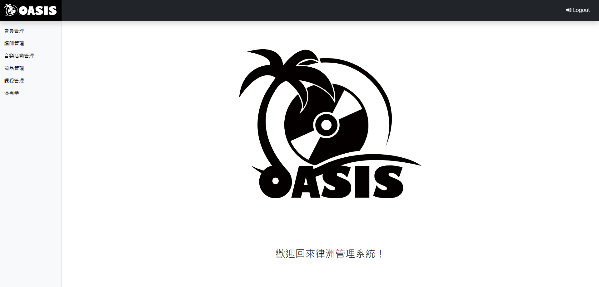

# side-project
資策會小型專案 

1.以php撰寫，需以phpMyadmine Apache開啟  
2.需先下載xampp，開啟apache和mysql 
3.檔案放入htdoc 
4.開啟瀏覽器http://localhost/side-project/dashboard.html 

負責部分:優惠券增刪查改(CRUD) 
discountIndex_Ch.php(目錄) 
discountCreat_Ch.php(新增頁面) 
editPage_Ch.php(編輯頁面) 
dosearch_Ch.php(搜尋、篩選頁面) 
doDelete_Ch.php(刪除頁面) 
discountDetail_Ch.php(優惠券詳細頁面) 

